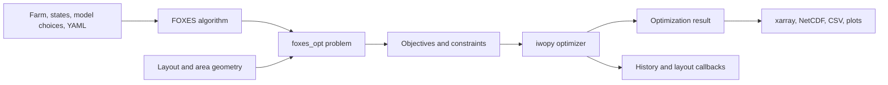

# FOXES Optimization Architecture

## Purpose

This document is the durable technical map of FOXES Optimization, distributed
as `foxes-opt` and imported as `foxes_opt`. The package connects FOXES wind-farm
simulations to iwopy optimization problems, optimizers, objectives,
constraints, callbacks, pipelines, and result writers. It is an established
scientific Python library, not an application scaffold.

Use [naming conventions](naming-conventions.md) for domain vocabulary, types,
array shapes, and identifiers. Use [docstring conventions](docstrings.md) for
public Python documentation and [development](development.md) for setup,
quality gates, test selection, documentation builds, and navigation. Record the
reason for a consequential change in an [ADR](adr/README.md).

## Authoritative Sources

When sources disagree, use this order:

1. `AGENTS.md` and any applicable scoped repository instructions
2. Accepted ADRs in `docs/adr/`, for decisions within those policies
3. This architecture document and `docs/naming-conventions.md`
4. Public contracts and configuration in `foxes_opt/` and `pyproject.toml`
5. Tests that exercise the contract
6. Examples, notebooks, and external references

Code and tests establish current runtime behavior and can expose documentation
drift, but they do not silently replace a documented durable decision. Resolve
the conflict and update the record in the same change.

## System Context

FOXES Optimization serves wind-energy researchers, engineers, and developers
who optimize wind-farm controls or layouts. FOXES owns wind-farm simulation and
its execution engine. iwopy owns the generic optimization lifecycle and
optimizer interfaces. `foxes_opt` adapts optimization variables to FOXES model
inputs and turns FOXES results or layout geometry into iwopy objective and
constraint components.

- Runtime: Python 3.10 through 3.14 on operating-system-independent Python
	environments.
- Primary integrations: FOXES for simulation, iwopy for optimization, pymoo and
	pygmo optimizer backends, and xarray/NetCDF for structured results.
- FOXES Optimization is an in-process library and command-line toolkit. It has
	no application server, authentication boundary, persistent database, or
	browser frontend.
- FOXES engines own serial or parallel simulation execution. Optimization
	problems and functions must not reimplement engine chunking.

## Primary Execution Flow

1. Construct the FOXES `WindFarm`, `States`, `ModelBook`, and simulation
	`Algorithm` required by the optimization.
2. Construct a `FarmOptProblem` subtype, a geometry-only layout problem, or a
	pipeline that owns those objects.
3. Add objectives, constraints, and optional optimizer callbacks before
	initializing the problem and optimizer.
4. Solve through an iwopy optimizer, usually while a FOXES engine context is
	active.
5. Finalize optimizer resources and evaluate the selected solution.
6. Return the iwopy result or write xarray/NetCDF, CSV, layout, history, and plot
	outputs through the owning output or callback API.

The YAML entry point constructs the same FOXES algorithm, problem, objective,
constraint, optimizer, and output objects from configuration. Pipelines compose
the same contracts into repeatable layout-generation and optimization stages.

## Module Boundaries

| Module | Owns | Main interfaces and dependencies |
|---|---|---|
| `foxes_opt.core` | FOXES-to-iwopy problem adapters and shared farm-variable behavior | `FarmOptProblem`, `FarmVarsProblem`, `FarmObjective`, `FarmConstraint`; depends on FOXES and iwopy contracts |
| `foxes_opt.problems` | Concrete optimization problem formulations | `OptFarmVars`, layout problems, local-move problems, and geometry-only regular-grid problems |
| `foxes_opt.objectives` | Objective functions over FOXES results or geometry | `FarmVarObjective`, power, REWS, turbulence, turbine-count, and geometry objectives |
| `foxes_opt.constraints` | Boundary, spacing, grouping, and geometry constraints | Area, minimum-distance, nearest-group, and regular-grid constraints with declared component and derivative contracts |
| `foxes_opt.callbacks` | Optimizer-event side effects | Layout snapshots and optimization-history output; depends on iwopy callback events and explicit output paths |
| `foxes_opt.pipelines` | Multi-stage layout workflows and propagated stage results | `LayoutPipeline` and ambient-row, greedy-sweep, optimizer, and random-subset stages |
| `foxes_opt.input` | External configuration and construction | YAML parsing, class-name resolution, CLI argument handling, and boundary validation |
| `foxes_opt.output` | Structured optimization-result conversion and writing | Single- and multi-objective xarray/NetCDF writers |
| `examples` and `notebooks` | Executable public workflows | Public package APIs and documented optional tools |
| `tests` | Unit, derivative, integration, callback, and pipeline coverage | May inspect internals only when the internal contract itself is under test |

The package root exports the core problem, objective, and constraint bases and
the callbacks, constraints, input, objectives, output, and problems subpackages.
Pipelines remain an explicit subpackage import. A helper does not become public
merely because another package module imports it.

## Runtime Contracts

### Optimization Lifecycle

An iwopy problem owns optimization variables and registered objective and
constraint functions. Add functions before initialization. Initialize the
problem and optimizer before solving, and finalize the optimizer after use so
backend resources are released.

`FarmOptProblem` owns the FOXES simulation algorithm used for evaluation. It
applies one individual or population of optimization variables, calculates
farm results and optional point results, and exposes those results to functions.
If evaluation begins without an active FOXES engine, the problem opens a default
engine for that calculation. Callers that need a specific backend or lifecycle
should provide an explicit engine context.

Geometry-only problems own coordinate geometry and do not require a FOXES farm
calculation. Keep that distinction visible: a layout can be an optimization
variable set without being a calculated `WindFarm` result.

### Individuals And Populations

iwopy passes integer and floating-point optimization variables separately:

- One individual uses `vars_int` and `vars_float` arrays shaped
	`(n_vars_int,)` and `(n_vars_float,)`.
- A vectorized population uses arrays shaped `(n_pop, n_vars_int)` and
	`(n_pop, n_vars_float)`.
- `layout_xy` uses `(n_turbines, 2)` and stores horizontal coordinates in
	meters unless an owning API explicitly declares another convention.
- Farm-variable mappings use `(n_states, n_selected_turbines)` for one
	individual and `(n_pop, n_states, n_selected_turbines)` for a population.

Population evaluation expands the original FOXES states through
`PopulationStates`. The resulting state axis is population-major: all original
states for one candidate precede the states for the next candidate. Preserve
`n_pop` and the original state count when reshaping results; a numerically
correct array in state-major order is invalid.

Layout candidates and final champion layouts are state-independent. Direct and
local layout problems temporarily expand each population member's turbine
positions over its original states, install those coordinates before FOXES
state initialization, and restore scalar `(2,)` turbine positions when applying
an individual or finalizing a champion.

Use FOXES `FC` constants for structural dimensions and `FV` constants for
physical variables. Do not duplicate their string values in optimization code.

### Functions And Derivatives

An iwopy objective or constraint can return multiple scalar components. The
component count, names, bounds, and ordering are public function contracts.
Constraints use iwopy's sign convention through their declared bounds; callers
must not infer feasibility from an undocumented local sign convention.

Geometry constraints and objectives may provide analytical derivatives.
Objectives derived from FOXES farm or point calculations require an explicit
finite-difference wrapper such as `iwopy.LocalFD` when a gradient-based
optimizer needs derivatives. Do not advertise analytical derivatives where the
simulation path does not provide them.

Each constraint object owns its feasibility tolerance. Pipeline-created
constraint families receive independent constructor mappings: explicit
boundary entries use their `constraints` mapping, while the automatic
minimum-distance family uses `min_dist_constraint_pars`. Do not collapse
physically distinct families into one optimizer-wide tolerance.

### Pipelines And Callbacks

`LayoutPipeline` owns ordered stage execution. A stage receives the previous
stage's result as `prev_results` and returns `(success, results)`; layout stages
accept a layout array or a tuple whose first item is that array. An optimizer
stage constructs its FOXES algorithm and problem, forwards callbacks, solves and
finalizes, and returns the incoming layout when it cannot produce a valid
replacement. The completed layout pipeline returns `(success, results)`, where
successful layout results are converted to `(algo, farm_results)`.

A fresh pipeline run may supply finite turbine coordinates through
`initial_layout`; the first selected stage receives that array directly. This
does not imply persisted-run continuation, callback offsets, history append
mode, or preservation of the existing pipeline table.

A restart selects a persisted `layout_<index>.csv` by numeric suffix, validates
its turbine order and coordinate array, and supplies it as the initial result
for the first selected stage. Restart directories resolve below the pipeline
base directory unless absolute. Ambiguous suffixes fail rather than choosing a
file by lexical order.

Callbacks run from iwopy optimizer events and may write layouts, figures, or
history. They must use explicit paths, remain deterministic for a given event
sequence, and avoid owning the optimizer lifecycle. Snapshot and history
offsets continue numbering after a restart. History append mode requires the
existing CSV schema; ordinary initialization replaces existing history. When
enabled, the step-zero layout snapshot evaluates the optimizer problem's
initial variables during callback initialization so objective and constraint
validity output is accurate before the first optimizer event.
Optimization history independently accepts `write_initial=False`; enabling it
evaluates the initial integer and float variables and writes their selected
objective and constraint-violation count at `iteration_offset`. The CSV schema
is unchanged. Disable initial history output when appending a restart whose
starting row already exists.

See [ADR-0003](adr/0003-restartable-layout-optimization.md) for the coordinated
restart and output-continuation contract.

## Extension Points

### Problems, Objectives, And Constraints

Add a new optimization formulation under the module that owns its domain. Base
it on the narrowest applicable iwopy or `foxes_opt.core` contract. Declare
variable names, component names, bounds, population behavior, and derivatives
explicitly. Re-export a class only when downstream callers should treat it as
public.

A function over FOXES results belongs in `objectives` or `constraints`; variable
application and simulation orchestration remain in the problem. A geometry-only
function should not depend on a FOXES algorithm merely to share code.

### YAML Construction

YAML construction resolves supported problem, objective, constraint, optimizer,
and output classes by public class name and forwards validated parameters to
their constructors. Class names and YAML keys are compatibility-sensitive.
Parsing and resolution stay in `foxes_opt.input`; calculation modules should not
parse configuration files.

### Pipelines And Outputs

Pipeline stages implement one composable transformation of the shared layout
workflow. Result writers translate iwopy results to xarray at the output
boundary; optimization internals remain NumPy-based. New writers must preserve
objective/constraint component ordering and identify dimensions and variables
in the returned dataset.

## Data And Integration Boundaries

FOXES Optimization does not own a persistent database. It reads caller-provided
Python objects and YAML, geometry, layout, and scientific input files; holds
simulation and optimization state in memory; and writes results only through
explicit output, pipeline, callback, or command-line APIs.

- Validate YAML keys, class names, paths, coordinate shapes, variable mappings,
	and optimizer settings at their input boundary.
- Preserve exceptions as causes when adding context. Errors should identify the
	problem, function, component, variable, stage, backend, or path involved.
- Keep reusable behavior below CLI argument parsing so tests and Python callers
	do not need to spawn a subprocess.
- FOXES and iwopy are external public contracts. When an integration contract
	changes, update the adapter, tests, examples, dependency floor, and
	documentation together.
- Input data retains its own classification. Site coordinates, turbine and
	operational data, measured atmospheric series, and unpublished optimization
	results may require the classification question in
	[AGENTS.md](../AGENTS.md#data-classification). Synthetic tests and public
	examples do not authorize inspection of another data set.
- No data-classification exception is currently recorded; see
	[data-classification-exceptions.md](data-classification-exceptions.md).

## Performance And Parallelism

Vectorization over populations, states, turbines, objective components, and
constraint components is an architectural property where a problem declares
population support. Preserve it instead of looping over candidates solely for
implementation convenience.

- Keep population-major state ordering through FOXES calculations and result
	contractions.
- Let FOXES engines own simulation chunking and worker execution.
- Avoid copying an entire farm result or geometry Jacobian per component when a
	shared vectorized calculation is available.
- Keep analytical derivative arrays aligned with iwopy variable and component
	ordering.
- Compare vectorized and single-individual values when changing population
	evaluation.
- Measure representative farm, state, population, and constraint sizes before
	accepting a memory or runtime optimization.

## Public Interfaces

Public contracts include exported Python classes and functions, objective and
constraint component names/order, optimization variable names, YAML keys and
class names, pipeline stage data keys, xarray/NetCDF and CSV result structure,
and the `foxes_opt_yaml` console script declared in `pyproject.toml`.

Compatibility-sensitive means identifying the complete impact and moving all
maintained callers, tests, examples, and documentation to the new contract in
one change. It does not imply retaining a legacy path; development is
forward-only by default under
[ADR-0001](adr/0001-forward-only-development.md).

## Cross-Cutting Decisions

- Development is strictly forward-looking by default. Superseded code and
	contracts are removed rather than kept behind compatibility shims; a bounded
	legacy exception requires explicit authorization and a recorded removal
	condition. See [ADR-0001](adr/0001-forward-only-development.md).
- Code changes require focused and full tests. Every change requires full
	pre-commit, affected public docstrings, the current-version final
	`CHANGELOG.md` section, and synchronized FOXES Optimization documentation as
	one completion gate. See
	[ADR-0001](adr/0001-forward-only-development.md).
- `pyproject.toml` is the source of package metadata, supported Python versions,
	dependencies, extras, build configuration, console scripts, and mypy settings.
- The developer owns the local uv environment and its editable FOXES and iwopy
	installs. Routine development commands use `uv run --no-sync`; contributors
	ask the developer to re-sync rather than changing dependencies during a task.
- Production Python under `foxes_opt/` is type checked. Tests, examples,
	notebooks, and docs are not currently part of the mypy target.
- Public Python APIs follow [docstring conventions](docstrings.md): NumPy-style
	docstrings expose optimization, scientific, and runtime contracts while types
	remain in annotations.
- Ruff formatting/linting and mypy run through pre-commit. Pytest is the test
	runner; Sphinx with AutoAPI, numpydoc, and MyST-NB builds the documentation.
- FOXES Optimization follows the Fraunhofer corporate design. The repository
	has no browser UI and no design-token adapter; corporate requirements apply to
	matplotlib plots, callback snapshots, examples, notebooks, documentation, and
	brand assets. See [ADR-0002](adr/0002-corporate-design.md).

## ADR Triggers

Create or supersede an ADR when a change alters problem or function ownership,
optimization variable or result shapes, population ordering, derivative
semantics, YAML construction, pipeline stage contracts, supported runtime
range, dependency strategy, external integration, data boundary, UI design
policy, or a naming rule used across the package. A local implementation change
that preserves these contracts does not need an ADR.
