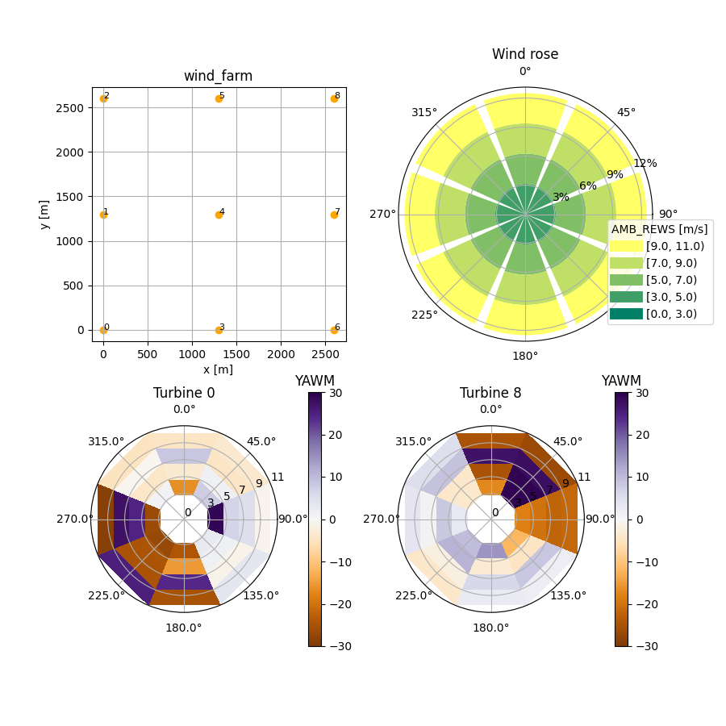

# Input parameter files

Instead of running wind farm optimizations via a Python script, it can also be run from input parameter 
files in [YAML](https://de.wikipedia.org/wiki/YAML) format. For this purpose the 
command line application `foxes_opt_yaml` has been added, following the conventions of [foxes_yaml](https://fraunhoferiwes.github.io/foxes.docs/parameter_files.html#foxes-yaml).

## foxes\_opt\_yaml

### Command and options

The command line tool `foxes_opt_yaml` accepts input yaml files that follow a specific
structure, that will be described shortly. A file with the name `inputs.yaml` can then be run in a terminal by

```console
foxes_opt_yaml inputs.yaml
```

The usage is exactly the same as for [foxes_yaml](https://fraunhoferiwes.github.io/foxes.docs/parameter_files.html#foxes-yaml). 
The optimization specifications are simply another section that is added to the *yaml* file.

### Input file structure

Let's look at an example, available [here](https://github.com/FraunhoferIWES/foxes-opt/blob/main/examples/yaml_input/inputs.yaml) in the *foxes-opt* repository:

```yaml
# -----------
# foxes setup
# -----------

engine:
  engine_type: process
  chunk_size_states: 400

states:
  states_type: ScanStates
  scans:
    WS: [4, 6, 8, 10]
    WD: [0, 45, 90, 135, 180, 225, 270, 315]
    TI: [0.05]
    RHO: [1.225]
  
wind_farm:
  layouts:
    - function: add_grid
      steps: [3, 3]
      xy_base: [0.0, 0.0]
      step_vectors: [[1300.0, 0], [0, 1300.0]]
      turbine_models: [opt_yawm, yawm2yaw, NREL5MW]   # Notice the opt_yawm model

algorithm:
  algo_type: Downwind
  wake_models: ["Bastankhah2016_linear_ka02", "CrespoHernandez_quadratic_ka04"]
  wake_frame: yawed

# ------------------
# optimization setup
# ------------------

optimization:
  problem:
    name: opt_yawm                    # Name of the turbine model, wind_farm section
    problem_type: OptFarmVars         # Name of the optimization problem class
    functions:                        # The following functions are called before init
      - name: add_var                 # For this problem we need to add an opt variable
        variable: YAWM
        typ: float
        init: 0.0
        min: -30.0
        max: 30.0
        level: state-turbine          # one variable per state and turbine
    objectives:                       # add all objectives here to the list
      - objective_type: MaxFarmPower  
    # constraints can be added here similarly

  optimizer:
    optimizer_type: Optimizer_pymoo
    problem_pars:
      vectorize: True
    algo_pars:
      type: GA
      pop_size: 100
      seed: 42
    term_pars: [n_gen, 100]

# -------
# outputs
# -------

outputs:

  # write results to netCDF file:
  - output_type: SingleObjResultsWriter
    functions:
      - function: write_nc
        fname: results.nc
  
  # Create a rather complex plot and save it:
  - output_type: plt          
    functions:
      - function: figure
        figsize: [9, 9]
        result_labels: $fig
  - object: $fig
    functions:
      - function: add_subplot
        args: [2, 2, 1]
        result_labels: $ax1
      - function: add_subplot
        args: [2, 2, 2]
        polar: True
        result_labels: $ax2
      - function: add_subplot
        args: [2, 2, 3]
        polar: True
        result_labels: $ax3
      - function: add_subplot
        args: [2, 2, 4]
        polar: True
        result_labels: $ax4
  - output_type: FarmLayoutOutput
    functions:
      - function: get_figure
        fig: $fig
        ax: $ax1
  - output_type: RosePlotOutput
    functions:
      - function: get_figure
        turbine: 4
        ws_var: AMB_REWS
        ws_bins: [0, 3, 5, 7, 9, 11]
        wd_sectors: 8
        title: Wind rose
        fig: $fig
        ax: $ax2
  - output_type: WindRoseBinPlot
    functions:
      - function: get_figure
        turbine: 0
        title: Turbine 0
        variable: YAWM
        ws_bins: [0, 3, 5, 7, 9, 11]
        wd_sectors: 8
        contraction: mean_no_weights
        cmap: PuOr
        vmin: -30
        vmax: 30
        fig: $fig
        ax: $ax3
      - function: get_figure
        turbine: 8
        title: Turbine 8
        variable: YAWM
        ws_bins: [0, 3, 5, 7, 9, 11]
        wd_sectors: 8
        contraction: mean_no_weights
        cmap: PuOr
        vmin: -30
        vmax: 30
        fig: $fig
        ax: $ax4
  - output_type: plt
    functions:
      - function: savefig
        fname: result.png
      - function: show
```

The details, especially concerning this complex output plot creation, are explained in the [foxes documentation](https://fraunhoferiwes.github.io/foxes.docs/parameter_files.html). The following image is produced by running the example:



